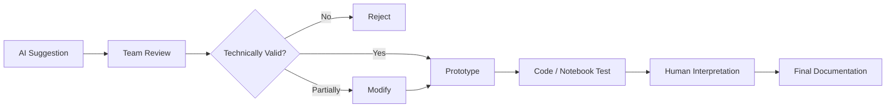

# AI Transparency Report

> 본 문서는 프로젝트 수행 과정에서 AI 도구를 어떻게 활용했는지, 어떤 부분은 인간이 직접 판단했는지, AI 제안을 어떻게 검증·수정했는지 기록합니다.  
> 목적은 연구 결과의 책임 소재를 명확히 하고, AI 보조 사용이 연구의 독립성과 신뢰성을 해치지 않았음을 투명하게 설명하는 것입니다.

---

## 1. Summary

본 연구는 AI 도구를 **연구 수행의 보조 수단**으로 활용했습니다. 연구 주제 선정, 핵심 문제 정의, 데이터셋 선정, 실험 설계, 최종 방법론 판단은 팀이 직접 수행했습니다.

AI는 다음 작업에 제한적으로 사용되었습니다.

- 논문 개념 정리
- 방법론 비교 보조
- 예시 코드 초안 생성
- Colab 구조 설계 보조
- 면담 내용 정리
- 문서 표현 다듬기

AI가 생성한 내용을 그대로 연구 결과로 사용하지 않았으며, 기술적 타당성은 팀이 직접 검토했습니다.

---

## 2. AI Tools Used

| Tool | Usage |
|---|---|
| Claude AI | 연구 아이디어 구체화, 방법론 비교, 예시 코드 생성 보조 |
| ChatGPT | 논문 개념 정리, 실험·코드 아이디어 보조, 면담 내용 정리 |
| Lilys AI | 논문 분석 및 이해, 면담 내용 정리 |
| Gemini | Google Colab 코드 구조 설계 보조 |

---

## 3. Human-Led Research Decisions

다음 핵심 영역은 팀이 직접 결정했습니다.

| 영역 | 인간 주도 내용 |
|---|---|
| Research direction | domain shift 환경에서 CLIP zero-shot classification을 개선한다는 문제 설정 |
| Problem definition | 도메인 정보 미반영, TTA의 구조적 한계, outlier view 문제 정의 |
| Dataset selection | PACS, ImageNet 계열, domain-specific 10 datasets 선정 |
| Prompt design | 17개 도메인 prompt bank 구성 및 sketch prompt refinement |
| MTA integration | MTA를 domain estimation의 입력 feature 생성 단계로 통합 |
| Experimental design | MTA 적용 전후 PACS domain estimation accuracy 비교 |
| Final judgment | AI 제안 중 기술적으로 부적절하거나 중복된 구조 수정·기각 |

---

## 4. AI Suggestions That Were Modified or Rejected

AI의 제안 중 일부는 팀 검토를 거쳐 수정되거나 기각되었습니다.

| AI Suggestion | Team Review | Final Decision |
|---|---|---|
| CLIP 템플릿을 단순 평균하는 방식 | domain shift 환경에서 동적 적응성이 부족하다고 판단 | domain weight 기반 prompt blending으로 수정 |
| domain embedding을 MLP로 ViT에 삽입 | 추가 학습이 필요해 training-free 원칙과 충돌 가능 | CLIP 기존 projection 재활용 방향으로 수정 |
| 텍스트 임베딩을 vision branch에 직접 삽입 | 구조적 타당성이 불명확하고 효과 검증 필요 | 실험 후보로만 유지, 확정 구현은 보류 |
| 새로운 prompt bank를 처음부터 제작 | CLIP 공식 템플릿과 기존 prompt 자산을 먼저 검토해야 한다고 판단 | 공식 템플릿 참고 후 domain-specific prompt로 확장 |
| 별도 coupled inference 단계를 추가 | 이미 text branch 결과가 image branch에 반영되는 구조와 중복 가능 | 중복 구조 제거 |
| 연구를 일반 Domain Adaptation으로 포지셔닝 | 테스트 시점 적응에 가까운 성격이라고 판단 | Test-Time / Training-Free Domain-Adaptive CLIP으로 재정리 |

---

## 5. Verification Process

AI 보조 결과는 다음 절차로 검토했습니다.



검증 기준은 다음과 같습니다.

- 연구 목표와 일치하는가?
- training-free 조건을 해치지 않는가?
- 기존 CLIP / TPT / DiffTPT / MTA 문헌과 충돌하지 않는가?
- 실제 코드로 구현 가능한가?
- 실험 결과로 확인 가능한가?
- 현재 구현 범위와 future work가 명확히 구분되는가?

---

## 6. AI Was Not Used For

본 프로젝트에서 AI는 다음 목적에는 사용하지 않았습니다.

| Not Used For | Explanation |
|---|---|
| 실험 결과 조작 | 모든 수치는 팀의 실험 및 보고서 기준으로 기록 |
| 데이터셋 라벨 임의 생성 | PACS 등 benchmark의 기존 label 사용 |
| 논문/출처 허위 생성 | 참고문헌은 실제 관련 연구 기반으로 작성 |
| 최종 연구 판단 자동화 | 핵심 방법론 선택과 한계 인식은 팀이 직접 수행 |
| 무검증 코드 병합 | AI가 제안한 코드는 팀 검토 후 수정 또는 폐기 |

---

## 7. Responsibility Statement

AI 도구는 연구 보조 역할을 수행했지만, 다음에 대한 책임은 프로젝트 팀에 있습니다.

- 연구 문제 정의
- 실험 설계
- 코드 구현 및 검증
- 결과 해석
- 한계와 향후 연구 방향 설정
- README 및 문서화 내용의 정확성

즉, AI는 연구의 공동 저자나 자동 의사결정자가 아니라, 생산성과 이해를 돕는 보조 도구로 사용되었습니다.

---

## 8. Limitations of AI Assistance

AI 활용 과정에서 다음 한계를 인식했습니다.

| Limitation | Risk | Team Response |
|---|---|---|
| 개념 혼동 | DA, TTA, prompt tuning 등의 용어가 혼재될 수 있음 | 연구 포지셔닝을 팀이 직접 재정리 |
| 그럴듯한 잘못된 제안 | 구현 불가능하거나 연구 목표와 맞지 않는 구조 제안 가능 | 코드/문헌 기준으로 검증 |
| 중복 구조 제안 | 이미 pipeline에 포함된 기능을 별도 단계로 제안할 수 있음 | 전체 architecture 기준으로 중복 제거 |
| 실험 수치 추론 | 실제 실험 없이 성능을 예측할 수 있음 | 실제 측정 수치만 문서에 반영 |
| 코드 호환성 문제 | 라이브러리 버전이나 환경 차이를 고려하지 못할 수 있음 | Colab/local 환경에서 직접 테스트 |

---

## 9. Documentation Transparency

본 저장소의 문서화는 다음 원칙을 따릅니다.

1. 현재 구현된 기능과 future work를 분리해 작성합니다.
2. 실험 완료 수치와 예정 실험을 구분합니다.
3. AI가 제안한 아이디어라도 팀이 검증한 내용만 반영합니다.
4. 구현되지 않은 기능을 완료된 기능처럼 표현하지 않습니다.
5. 실행 재현성과 한계를 함께 기록합니다.

```text
본 프로젝트에서는 논문 이해, 아이디어 정리, 코드 초안, 문서 표현 보조를 위해 AI 도구를 제한적으로 활용하였다. 연구 방향 설정, 데이터셋 선정, 실험 설계, 구현 검증, 결과 해석은 팀이 직접 수행했으며, AI가 제안한 내용은 기술적 타당성과 연구 목표 부합 여부를 기준으로 수정 또는 기각하였다.
```
