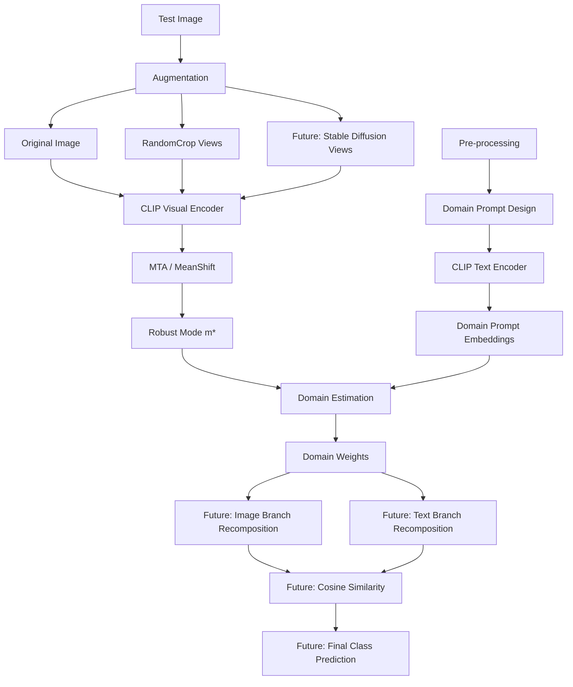
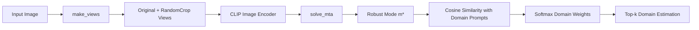

# Architecture

> 본 문서는 `chairwomans-capstone`의 제안 파이프라인과 현재 구현 범위를 구분하여 설명합니다.  
> 핵심 목표는 **테스트 이미지의 도메인을 자동으로 추정하고, 추정된 도메인 정보를 활용해 CLIP 기반 Zero-Shot 분류를 도메인 변화에 강건하게 만드는 것**입니다.

---

## 1. Problem Setting

기존 CLIP Zero-Shot Classification은 클래스별 텍스트 프롬프트를 미리 평균하여 고정된 class prototype을 만들고, 입력 이미지 임베딩과의 코사인 유사도를 비교합니다.

이 방식은 간단하고 강력하지만, 테스트 이미지의 도메인이 바뀌어도 동일한 텍스트 기준을 사용한다는 한계가 있습니다.

예를 들어 같은 `dog` 클래스라도 다음 도메인에서는 시각적 분포가 크게 달라집니다.

- photo
- sketch
- cartoon
- embroidery
- rendering

본 연구는 이 문제를 다음 질문으로 정의합니다.

> Backpropagation 없이 테스트 시점에서 도메인을 자동으로 추정하고, 추정된 도메인 정보를 텍스트·이미지 임베딩 양쪽에 반영하면 Domain Shift 환경에서도 robust한 Zero-Shot Classification이 가능한가?

---

## 2. High-Level Pipeline

전체 제안 파이프라인은 사전 단계와 테스트 단계로 구성됩니다.



---

## 3. Pre-processing Stage

사전 단계에서는 도메인 추정에 사용할 텍스트 프롬프트를 구성하고, CLIP text encoder로 임베딩합니다.

```text
도메인별 텍스트 프롬프트 구성
→ CLIP 기본 템플릿 검토
→ 도메인 관련 템플릿 추가 및 수정
→ 최종 도메인 프롬프트 확정
→ 도메인 프롬프트 임베딩 사전 계산
```

### Final Domain Set

현재 저장소의 `domain_prompts.py`는 다음 17개 도메인을 사용합니다.

```text
photo, cartoon, deviantart, embroidery, graffiti, graphic, misc,
origami, sculpture, sketch, sticker, tattoo, toy, videogame,
drawing, rendering, plastic
```

---

## 4. Test-Time Stage

테스트 시점에는 이미지 한 장만 입력됩니다. 현재 구현은 이 이미지에서 여러 RandomCrop view를 만들고, CLIP image encoder와 MTA를 거쳐 robust mode `m*`를 계산한 뒤, 도메인 프롬프트와의 유사도로 도메인을 추정합니다.



### Current Code Mapping

| Pipeline Step | Current Implementation | File |
|---|---|---|
| Image upload | FastAPI endpoint `/predict` | `server.py` |
| Original + crop views | `make_views(image, n_views)` | `mta.py` |
| CLIP image encoding | `model.encode_image(inputs)` | `mta.py` |
| MTA robust mode | `solve_mta(model, inputs, args)` | `mta.py` |
| Domain prompt text encoding | `_build_domain_features()` | `clip_pipeline.py` |
| Domain estimation | `estimate_domain(image, n_views, top_k)` | `clip_pipeline.py` |
| Web demo rendering | HTML/CSS/JS static files | `web-demo/` |

---

## 5. Currently Implemented vs Proposed

이 프로젝트는 1년 주기 연구 프로젝트의 Start 단계 결과물을 포함합니다. 따라서 최종 논문 수준의 전체 파이프라인과 현재 공개 구현 범위를 분명히 구분합니다.

### Implemented Now

| Component | Status | Notes |
|---|---|---|
| CLIP ViT-B/32 loading | Done | `clip.load("ViT-B/32")` |
| RandomCrop TTA views | Done | 원본 1장 + crop `n_views` |
| MTA robust mode | Done | MeanShift 기반 `m*` 계산 |
| Domain prompt bank | Done | 17 domains, 75 prompts |
| Domain estimation | Done | Top-k domain weights 반환 |
| FastAPI demo | Done | HuggingFace Space / local |
| Colab self-demo | Done | `self_demo.md`, `Demo.ipynb` |

### Proposed / Future Work

| Component | Status | Why it matters |
|---|---|---|
| Stable Diffusion 63-view integration | Planned | RandomCrop만으로 부족한 view diversity 보완 |
| Domain-weighted text embedding | Planned | 클래스 템플릿을 도메인 가중치로 재조합 |
| Image branch hint token | Planned | 이미지 인코더에도 도메인 맥락 반영 |
| Linear projection alignment | Planned | ViT 내부 표현과 CLIP embedding 차원 정렬 |
| Final Zero-Shot classification | Planned | TPT, DiffTPT, MaPLe 등과 최종 정확도 비교 |
| Temperature ablation | Planned | softmax domain weight의 sharpness 분석 |

---

## 6. Design Rationale

### 6.1 Why Domain Estimation First?

기존 CLIP은 입력 이미지가 어떤 도메인인지 고려하지 않습니다. 본 연구는 먼저 도메인을 추정한 뒤, 그 정보를 이후 분류 기준에 반영하는 구조를 제안합니다.

이 접근은 다음 장점을 가집니다.

- 도메인 변화가 모델 판단에 어떻게 반영되는지 확인 가능
- 단일 평균 prompt prototype보다 해석 가능성이 높음
- training-free 방식으로 테스트 시점에 적용 가능
- 향후 text branch와 image branch 모두에 같은 도메인 정보를 주입 가능

### 6.2 Why MTA Before Domain Estimation?

RandomCrop view 중에는 객체가 잘리거나 배경만 포함되는 outlier view가 생길 수 있습니다. 단순 평균을 사용하면 이러한 view가 대표 임베딩을 오염시킬 수 있습니다.

MTA는 여러 view의 임베딩 분포에서 밀도가 높은 mode를 찾고, inlierness score를 통해 신뢰도 높은 view에 더 큰 영향을 주는 방식으로 robust mode `m*`를 계산합니다.

즉, 본 프로젝트에서 MTA는 단순 보조 기법이 아니라 **도메인 추정의 입력 품질을 높이는 핵심 단계**입니다.

---

## 7. API-Level View

현재 데모는 `/predict` endpoint에서 동작합니다.

```text
POST /predict
Input: image file
Output:
{
  "predicted_domain": "sketch",
  "weights": {
    "sketch": 0.7065,
    "cartoon": 0.2480,
    "drawing": 0.0278,
    "photo": 0.0177
  }
}
```

실제 반환 도메인과 weight 값은 입력 이미지와 `n_views` 설정에 따라 달라집니다.

---

## 8. Implementation Notes

- 현재 `estimate_domain()`의 기본 `n_views`는 127이며, 원본 1장을 포함해 총 128개 view가 생성됩니다.
- Stable Diffusion은 연구 노트북에서 후보 방식으로 비교되었고, 현재 웹 데모의 실시간 pipeline에는 포함되어 있지 않습니다.
- 현재 웹 데모는 최종 class prediction이 아니라 domain estimation module의 초기 검증 데모입니다.
- 최종 Zero-Shot classification은 향후 text/image embedding recomposition이 구현된 뒤 정량 평가할 예정입니다.
