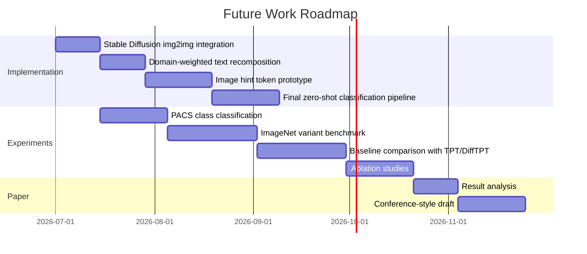

# Limitations and Future Work

> 본 문서는 현재 연구의 한계를 숨기지 않고 명확히 정리하며, 향후 Growth 단계에서 확장할 연구 계획을 로드맵 형태로 제시합니다.

---

## 1. Current Status

현재 repository에서 구현 및 검증이 완료된 범위는 다음과 같습니다.

| Component | Status |
|---|---|
| CLIP ViT-B/32 기반 image embedding | 완료 |
| RandomCrop 기반 test-time views | 완료 |
| MeanShift 기반 MTA robust mode `m*` | 완료 |
| 17개 domain prompt bank | 완료 |
| PACS 기반 domain estimation 검증 | 완료 |
| FastAPI web demo | 완료 |
| Stable Diffusion integration | 후보 실험 완료, 메인 데모 미통합 |
| Text/image embedding recomposition | 향후 구현 |
| Final Zero-Shot class classification | 향후 평가 |

---

## 2. Current Limitations

### 2.1 Domain Prompt Expressiveness

현재 도메인 추정은 수작업으로 설계한 domain prompt bank에 의존합니다. Prompt를 구체화하면 도메인 구분이 좋아질 수 있지만, prompt 자체가 표현할 수 있는 도메인 특성에는 한계가 있습니다.

특히 CLIP embedding space에서는 domain 정보와 class 정보가 완전히 분리되어 있다고 보기 어렵습니다. 따라서 특정 domain prompt가 특정 object prior와 함께 작동할 수 있습니다.

#### Future Direction

- class-neutral domain prototype 구성
- 여러 class에 걸친 평균 domain representation 설계
- prompt pruning 및 prompt reweighting
- learned domain prompt vector 실험

---

### 2.2 Fixed Domain Pool

현재 모델은 17개 사전 정의 domain 중에서만 예측합니다.

즉, 입력 이미지가 새로운 domain에 속하더라도 모델은 가장 가까운 기존 domain으로 매핑합니다.

#### Future Direction

- unknown domain detection
- open-set domain estimation
- domain prototype expansion
- dataset-driven domain discovery

---

### 2.3 Single-Domain Assumption vs Weighted Mixture

실제 이미지는 대체로 하나의 주요 domain에 속하지만, 현재 방식은 softmax를 통해 여러 domain weight를 생성합니다.

이때 temperature에 따라 다음 문제가 생길 수 있습니다.

| Temperature | 현상 | 위험 |
|---|---|---|
| 너무 낮음 | 특정 domain에 weight 집중 | 사실상 argmax와 유사 |
| 너무 높음 | 여러 domain에 weight 분산 | domain 정보 희석 |

#### Future Direction

- softmax temperature ablation
- entropy-based confidence analysis
- top-1 domain vs weighted domain 비교
- domain weight calibration

---

### 2.4 Upstream Dependency on MTA Quality

현재 domain estimation은 MTA mode `m*`를 입력으로 사용합니다. 따라서 crop view 품질이 낮거나 배경 crop이 많으면 domain estimation도 영향을 받을 수 있습니다.

#### Future Direction

- 원본 이미지 기반 domain prior를 먼저 계산
- domain prior를 MTA view weighting에 반영
- saliency-aware crop 적용
- object-aware crop filtering

---

### 2.5 Stable Diffusion Not Yet Integrated into Demo

연구 노트북에서 Stable Diffusion 기반 후보 방식은 비교했지만, 현재 웹 데모에는 RandomCrop만 연결되어 있습니다.

#### Future Direction

- img2img `strength=0.3` 기반 view 생성 통합
- latency와 accuracy trade-off 분석
- real-time scenario와 accuracy-first scenario 분리
- Stable Diffusion view와 RandomCrop view의 비율 ablation

---

### 2.6 Final Zero-Shot Classification Not Yet Measured

현재 가장 중요한 한계는 전체 proposed pipeline 중 domain estimation까지 구현 및 검증되었다는 점입니다.

아직 다음 단계는 완료되지 않았습니다.

- domain-weighted text embedding recomposition
- image branch hint token insertion
- final class prototype construction
- final image-text cosine similarity classification
- TPT / DiffTPT / MaPLe와 정량 비교

#### Future Direction

이 부분은 Growth 단계의 핵심 연구 범위입니다.

---

## 3. Future Work Roadmap



실제 연구 일정에 더 앞당길 계획도 있습니다.

---

## 4. Planned Technical Extensions

### 4.1 Class-Neutral Domain Prototypes

현재 domain prompt는 도메인 표현만 포함하지만, CLIP space에서 class prior와 완전히 독립적이라고 보장할 수 없습니다.

향후에는 여러 class에 걸쳐 domain representation을 평균내는 방식으로 class-neutral prototype을 구성할 수 있습니다.

```text
for each domain:
    for each class:
        encode("a {domain} image of a {class}")
    average over classes
    produce class-neutral domain prototype
```

---

### 4.2 Domain-Weighted Text Embedding

현재 proposed text branch는 다음을 목표로 합니다.

```text
class templates × domain weights
→ weighted text prototype per class
```

예시:

```text
cat class prototype
= w_photo * "a photo of a cat"
+ w_sketch * "a sketch of a cat"
+ w_cartoon * "a cartoon image of a cat"
+ ...
```

이 방식이 기존 평균 prompt ensemble보다 domain shift에 강한지 검증해야 합니다.

---

### 4.3 Image Branch Hint Token

제안된 image branch는 domain 정보를 hint token 또는 prefix token 형태로 ViT 처리에 반영하는 방향입니다.

핵심 질문은 다음입니다.

> 도메인 정보가 image branch에도 주입되면 image-text alignment가 더 좋아지는가?

검증할 항목:

- hint token 삽입 위치
- hint token 차원 정렬
- projection 방식
- text-only adaptation 대비 성능 차이

---

### 4.4 Feature Disentanglement

지도교수님 의견에 따라, CLIP embedding space에서 domain 정보와 class 정보를 분리하는 방향도 탐색할 수 있습니다.

가능한 접근:

- domain direction estimation
- domain component removal
- adversarial domain classifier
- domain-invariant class representation

이 방향은 training-free 조건과 충돌할 수 있으므로, test-time training-free 버전과 offline learned 버전을 구분해야 합니다.

---

### 4.5 Prompt Tuning Extension

수작업 domain prompt를 초기값으로 사용하고, offline prompt tuning을 수행하는 방식도 고려할 수 있습니다.

이 경우 테스트 시점에는 여전히 training-free로 동작할 수 있습니다.

```text
offline phase: learn better domain prompt vectors
inference phase: use learned domain prototypes without backpropagation
```

---

## 5. Evaluation Roadmap

| Stage | Goal | Metric |
|---|---|---|
| Stage 1 | Domain estimation 검증 | domain accuracy |
| Stage 2 | Text-only domain weighting | zero-shot class accuracy |
| Stage 3 | Image-only MTA contribution | class accuracy / robustness |
| Stage 4 | Text + image recomposition | final class accuracy |
| Stage 5 | Baseline comparison | improvement over CLIP/TPT/DiffTPT |
| Stage 6 | Ablation | component-wise contribution |

---

## 6. Baseline Comparison Plan

| Baseline | Why Compare? |
|---|---|
| CLIP Zero-Shot | 가장 기본적인 고정 prompt ensemble |
| TPT | test-time prompt tuning 대표 방법 |
| DiffTPT | Stable Diffusion augmentation 활용 방법 |
| MTA-only | domain weighting 없는 image-side robust aggregation |
| MaPLe | multimodal prompt learning 기반 upper bound |

---

## 7. Success Criteria

향후 연구 성공 기준은 다음처럼 설정할 수 있습니다.

| Criterion | Target |
|---|---|
| PACS domain estimation | 현재 97.91% 유지 또는 개선 |
| Final classification | CLIP Zero-Shot 대비 개선 |
| Training-free inference | 테스트 시점 backpropagation 없음 |
| Ablation consistency | MTA, prompt weighting 각각의 기여 확인 |
| Visitor-friendly repo | 실행 방법, 결과, 한계 명확히 문서화 |

---

## 8. Summary

현재 프로젝트는 domain estimation module의 타당성을 검증한 Start 단계 연구 결과입니다.

가장 중요한 다음 단계는 다음 세 가지입니다.

1. domain weight를 실제 text/image embedding recomposition에 연결
2. final zero-shot class classification accuracy 측정
3. TPT, DiffTPT, MaPLe 등과의 정량 비교 수행

이 구분을 명확히 유지하는 것이 연구 신뢰성과 오픈소스 문서화 측면에서 가장 중요합니다.
