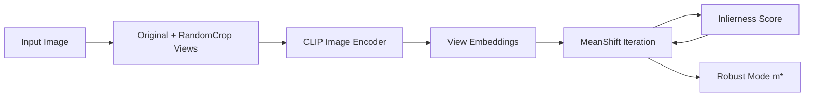
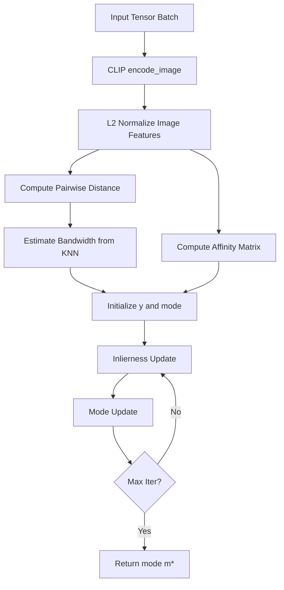

# MTA: MeanShift-based Test-Time Augmentation

> MTA는 여러 augmented view의 image embedding 중 outlier의 영향을 줄이고, 더 robust한 대표 embedding `m*`를 얻기 위한 핵심 단계입니다.

---

## 1. Motivation

Test-Time Augmentation(TTA)은 테스트 이미지 한 장에서 여러 augmented view를 생성한 뒤 예측을 종합해 안정성을 높이는 방법입니다.

하지만 모든 view가 유용한 것은 아닙니다.

RandomCrop을 사용하면 다음 문제가 생길 수 있습니다.

- 객체의 일부만 잘림
- 객체가 거의 보이지 않음
- 배경만 크게 확대됨
- 원본 의미와 다른 view가 생성됨

이런 outlier view를 단순 평균하면 최종 image embedding이 오염될 수 있습니다.

MTA는 이 문제를 해결하기 위해 augmented view embedding의 분포에서 신뢰도 높은 밀집 영역을 찾습니다.

---

## 2. Conceptual Overview



MTA는 다음 두 작업을 반복합니다.

1. **Inlierness update**  
   각 view가 대표 feature 계산에 얼마나 신뢰할 만한지 score를 계산합니다.

2. **Mode update**  
   inlierness가 높은 view를 더 크게 반영하여 mode `m*`를 업데이트합니다.

---

## 3. Current Implementation

현재 구현은 `mta.py`에 있습니다.

```python
def make_views(image, n_views):
    """return one original image + RandomResizedCrop n_views"""
```

이 함수는 다음을 반환합니다.

```text
1 original image tensor + n_views random crop tensors
```

`server.py`에서는 다음처럼 호출됩니다.

```python
result = estimate_domain(image, n_views=127, top_k=5)
```

따라서 현재 웹 데모는 다음 구성입니다.

```text
original 1 + RandomCrop 127 = 128 views
```

---

## 4. `solve_mta()` Flow

`solve_mta()`는 다음 절차로 robust mode를 계산합니다.



핵심 코드는 다음과 같습니다.

```python
weighted_affinity = affinity_matrix * y.unsqueeze(0)
y = F.softmax(
    1 / lambda_y * (density + lambda_q * torch.sum(weighted_affinity, dim=1)),
    dim=-1
)
```

그리고 mode는 inlierness-weighted density를 기반으로 업데이트됩니다.

```python
weighted_density = density * y
mode = torch.sum(weighted_density.unsqueeze(1) * image_features, dim=0) / torch.sum(weighted_density)
mode /= mode.norm(p=2, dim=-1)
```

---

## 5. Hyperparameters

현재 코드의 기본 설정은 다음과 같습니다.

| Parameter | Current Value | 의미 |
|---|---:|---|
| `lambda_y` | 0.2 | inlierness softmax sharpness 조절 |
| `lambda_q` | 4 | affinity term의 영향 조절 |
| `max_iter` | 5 | 내부 반복 횟수 제한 |
| `temperature` | 1 | affinity matrix softmax temperature |
| `k` for bandwidth | 30% of views | KNN 기반 bandwidth 추정 |

현재 값은 초기 검증용이며, 최종 논문/벤치마크 단계에서는 grid search 또는 ablation이 필요합니다.

---

## 6. Validation Results

보고서 기준 MTA mode 검증 결과는 다음과 같습니다.

| 평가 항목 | 값 | 해석 |
|---|---:|---|
| 원본 view ↔ mode cosine similarity | 0.9465 | mode가 원본 의미를 잘 반영 |
| 전체 view ↔ mode 평균 similarity | 0.9341 | view들이 대체로 의미 일관성 유지 |
| 전체 view ↔ mode similarity std | 0.0343 | view 간 변동이 크지 않음 |
| mode ↔ simple average feature similarity | 0.9918 | 전체 방향은 유지됨 |

### Important Interpretation

`mode ↔ simple average feature`가 매우 높다고 해서 MTA가 의미 없다는 뜻은 아닙니다.

MTA의 실제 효과는 다음 결과에서 확인됩니다.

```text
PACS domain estimation accuracy
MTA 미적용: 94.64%
MTA 적용:   97.91%
Improvement: +3.27%p
```

즉, mode의 방향은 평균과 비슷하더라도, outlier view의 영향이 줄어 domain estimation의 confidence와 accuracy가 개선될 수 있습니다.

---

## 7. Why MTA Matters in This Project

본 프로젝트에서 MTA는 단순히 최종 prediction을 평균내는 보조 기법이 아닙니다.

MTA는 domain estimation의 입력인 `m*`를 만듭니다.

```text
Noisy augmented views
→ MTA robust mode
→ Domain estimation
→ Future domain-aware text/image recomposition
```

따라서 MTA 품질이 낮으면 이후 domain estimation과 final classification 전체가 영향을 받습니다.

---

## 8. Known Limitations

| 한계 | 설명 | 개선 방향 |
|---|---|---|
| RandomCrop 의존성 | crop이 배경 위주로 생성될 수 있음 | saliency-aware crop, object-aware crop |
| Fixed hyperparameters | `lambda_y`, `lambda_q`가 고정됨 | dataset별 ablation |
| Stable Diffusion 미통합 | 현재 demo는 RandomCrop만 사용 | img2img 기반 view 추가 |
| Upstream dependency | `m*` 품질이 domain estimation에 직접 영향 | 원본 이미지 기반 domain prior를 MTA에 반영 |

---

## 9. Suggested Ablations

향후 다음 실험을 권장합니다.

| Ablation | 목적 |
|---|---|
| number of views: 16 / 32 / 64 / 128 | view 수와 성능/속도 trade-off 확인 |
| `lambda_y`: 0.05 / 0.1 / 0.2 / 0.5 | inlierness sharpness 영향 분석 |
| `lambda_q`: 1 / 2 / 4 / 8 | affinity term 영향 분석 |
| RandomCrop vs SD img2img vs combined | augmentation source의 영향 비교 |
| mean feature vs MTA mode | MTA 자체 기여도 분리 |
| domain entropy before/after MTA | domain confidence 변화 확인 |

---

## 10. Related Files

| File | Description |
|---|---|
| `mta.py` | `make_views()`, `solve_mta()` 구현 |
| `clip_pipeline.py` | MTA mode를 사용해 domain estimation 수행 |
| `server.py` | 이미지 업로드 후 `estimate_domain()` 호출 |
| `research/MTA_mode.ipynb` | MTA mode 수렴 실험 노트북 |
| `docs/EXPERIMENTS.md` | MTA 적용 전후 domain estimation 결과 |
