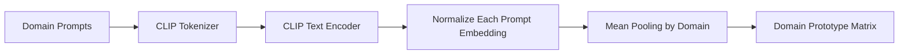
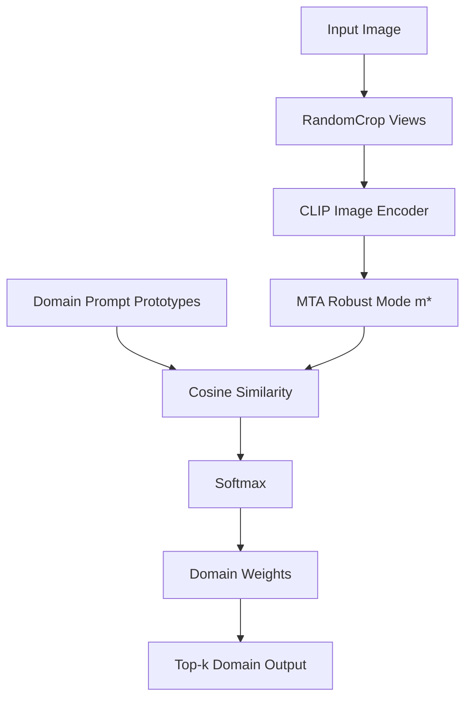

# Domain Prompts

> 본 프로젝트의 domain estimation은 `domain_prompts.py`에 정의된 domain prompt bank를 기반으로 합니다.  
> 최종 prompt bank는 **17개 도메인, 총 75개 템플릿**으로 구성되어 있습니다.

---

## 1. Why Domain Prompts?

기존 CLIP Zero-Shot Classification은 보통 class name을 prompt에 삽입합니다.

```text
a photo of a {class}
a sketch of a {class}
a cartoon image of a {class}
```

하지만 본 프로젝트에서는 class prediction 이전에 먼저 다음 질문에 답하고자 합니다.

> 이 이미지는 어떤 시각적 도메인에 속하는가?

이를 위해 class name 없이 도메인의 시각적 특성만 표현하는 prompt를 설계합니다.

```text
a real photo
a black and white sketch
a colorful cartoon illustration
an embroidered artwork
```

---

## 2. Prompt Design Principles

| 원칙 | 설명 |
|---|---|
| Domain-specific | class 정보보다 스타일, 질감, 표현 방식에 집중 |
| Visual attribute 중심 | 색, 선, 질감, 재료, 렌더링 방식 등 시각 단서 명시 |
| Ambiguity reduction | art painting, sketch, cartoon처럼 헷갈리는 도메인을 구분할 표현 추가 |
| Multiple templates | 하나의 표현에 과적합되지 않도록 여러 natural language prompt 사용 |
| CLIP-friendly wording | CLIP이 학습 중 자주 보았을 법한 자연스러운 영어 표현 사용 |

---

## 3. Final Domain Set

현재 `domain_prompts.py`의 17개 도메인은 다음과 같습니다.

| Domain | Prompt Count | 역할 |
|---|---:|---|
| photo | 5 | 실사 사진 |
| cartoon | 8 | 만화/애니메이션 스타일 |
| deviantart | 3 | 디지털 아트/스타일화된 그림 |
| embroidery | 3 | 자수/실로 만든 이미지 |
| graffiti | 3 | 벽면 그래피티/스프레이 아트 |
| graphic | 3 | 벡터 그래픽/평면 디자인 |
| misc | 3 | 기타 혼합 스타일 |
| origami | 3 | 접힌 종이 공예 |
| sculpture | 3 | 조각/입체 조형물 |
| sketch | 20 | 흑백 스케치/윤곽선/line art |
| sticker | 3 | 스티커/컷아웃 그래픽 |
| tattoo | 3 | 타투 디자인/잉크 드로잉 |
| toy | 3 | 장난감/플라스틱/인형 |
| videogame | 3 | 게임 렌더링/스크린샷 스타일 |
| drawing | 3 | 손그림/낙서/색연필 드로잉 |
| rendering | 3 | 3D 렌더링/컴퓨터 생성 이미지 |
| plastic | 3 | 플라스틱 질감/성형물 |

Total: **75 prompts**

---

## 4. Prompt Refinement Example: Sketch

초기 sketch prompt는 다음처럼 단순했습니다.

```python
"sketch": [
    "a black and white pencil sketch",
    "a grayscale line drawing",
    "a monochrome sketch",
]
```

이 버전은 sketch와 art painting 사이의 모호성을 충분히 줄이지 못했습니다. 두 도메인 모두 단색, 저채도, 손으로 그린 듯한 표현을 공유할 수 있기 때문입니다.

최종 prompt는 sketch의 고유한 시각 단서를 더 구체적으로 반영합니다.

```python
"sketch": [
    "a black and white sketch",
    "a grayscale sketch",
    "a line drawing",
    "a contour drawing",
    "an outline drawing",
    "a monochrome line drawing",
    "a black and white line art image",
    "a clean black outline drawing",
    "a sparse black line drawing on white background",
    "a sketch with only object contours",
    "a white background with thin black outlines",
    "a monochrome contour sketch",
    "a simple object outline drawing",
    "a line-art sketch with no shading",
    "a black ink outline drawing",
    "a sketch made only of edges and contours",
    "a minimal contour-only drawing",
    "a line art illustration",
    "a black and white line art drawing",
    "a minimal line-art image",
]
```

### Why This Helps

| 추가된 표현 | 기대 효과 |
|---|---|
| `contour`, `outline` | sketch를 회화보다 선 중심 표현으로 유도 |
| `white background`, `black outlines` | 배경과 색채 단서를 명확화 |
| `no shading`, `minimal` | painting/cartoon과의 질감 차이 강조 |
| `line art` | CLIP이 인식하기 쉬운 style keyword 활용 |

---

## 5. Prompt Encoding Flow

`clip_pipeline.py`에서는 각 domain의 prompt를 CLIP text encoder로 인코딩한 뒤 평균하여 domain prototype을 만듭니다.



현재 구현은 다음과 같은 구조입니다.

```python
def _build_domain_features():
    features = {}
    for domain, prompts in domain_prompts.items():
        tokens = clip.tokenize(prompts).to(device)
        with torch.no_grad():
            embeds = model.encode_text(tokens)
            embeds = embeds / embeds.norm(dim=1, keepdim=True)
        features[domain] = embeds.mean(dim=0)

    domain_features = torch.stack(list(features.values()))
    domain_names = list(features.keys())
    return domain_features, domain_names
```

---

## 6. Domain Estimation Flow

입력 이미지에서 MTA mode `m*`를 얻은 뒤, domain prototype들과의 cosine similarity를 계산합니다.



---

## 7. Known Limitations

### 7.1 Domain-Class Entanglement

도메인 prompt가 class name을 직접 포함하지 않더라도, CLIP embedding space에서는 domain 정보와 class 정보가 완전히 분리되어 있다고 보장할 수 없습니다.

예를 들어 `toy`, `plastic`, `sticker`는 특정 객체군과 강하게 연관될 수 있습니다. 이 경우 domain estimation이 순수한 style/domain이 아니라 object prior의 영향을 받을 수 있습니다.

### 7.2 Fixed Domain Pool

현재 모델은 사전에 정의된 17개 domain 중에서만 추정합니다. 따라서 새로운 domain이 들어오면 가장 가까운 기존 domain으로 매핑됩니다.

### 7.3 Weighted Average vs Single-Domain Reality

실제 이미지는 대체로 하나의 주요 domain에 속하지만, 현재 방식은 softmax를 통해 여러 domain weight를 생성합니다. 이 weight가 너무 sharp하면 argmax와 유사해지고, 너무 flat하면 domain 정보가 희석될 수 있습니다.

---

## 8. Future Improvements

| 방향 | 설명 |
|---|---|
| Class-neutral domain prototypes | 여러 class에 걸쳐 평균낸 순수 domain prototype 구성 |
| Temperature ablation | softmax temperature 변화가 domain weight에 미치는 영향 분석 |
| Learned prompt vectors | 수작업 prompt를 초기값으로 prompt tuning 실험 |
| Domain discovery | fixed domain pool 밖의 unknown domain 탐지 |
| Prompt pruning | 중복되거나 성능을 낮추는 prompt 자동 제거 |

---

## 9. Editing Guidelines

새 domain prompt를 추가할 때는 다음 기준을 지켜주세요.

1. class name을 직접 넣지 않습니다.
2. 도메인의 시각적 속성을 구체적으로 표현합니다.
3. 기존 domain과 헷갈리는 표현은 피합니다.
4. 최소 3개 이상의 prompt를 추가합니다.
5. PACS 또는 적절한 domain-labeled dataset에서 추정 정확도를 확인합니다.

Recommended format:

```python
"new_domain": [
    "a visually descriptive domain phrase",
    "another natural language domain phrase",
    "a third domain-specific visual description",
]
```
