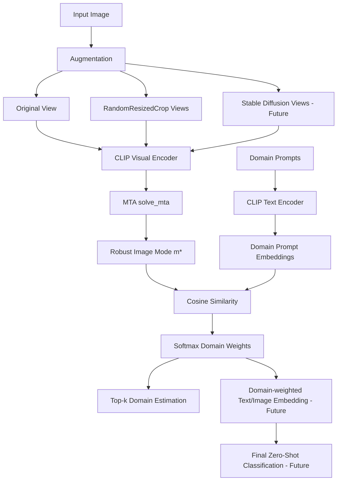

# Research Experiments

> 이 폴더는 메인 서비스 코드와 분리된 **연구 탐색·검증 전용 공간**입니다.  
> 각 노트북은 최종 서비스 파이프라인에 바로 연결되는 production code가 아니라, 제안 방법의 타당성을 검증하고 구현 방향을 결정하기 위한 실험 기록입니다.

---

## 1. Research Folder at a Glance

본 프로젝트는 **도메인 변환 환경에서 CLIP 기반 Zero-Shot 이미지 분류 성능을 개선**하는 것을 목표로 합니다.  
이를 위해 테스트 이미지 한 장에서 여러 augmented view를 만들고, MeanShift 기반 MTA로 robust image embedding을 계산한 뒤, 도메인 프롬프트와의 유사도를 통해 이미지의 도메인을 추정합니다.

현재 `research/` 폴더는 아래 세 가지 핵심 질문을 검증합니다.

| Research Question | 연결 노트북 | 핵심 역할 | 현재 상태 |
|---|---|---|---|
| 입력 이미지 한 장에서 충분히 다양한 view를 만들 수 있는가? | `DataAugmentation.ipynb` | RandomCrop / Stable Diffusion 기반 augmentation 탐색 | 완료 / 확장 예정 |
| 여러 view 중 outlier 영향을 줄인 robust representation을 만들 수 있는가? | `MTA_mode.ipynb` | MeanShift-based Test-Time Augmentation 검증 | 완료 |
| CLIP text prompt만으로 이미지의 도메인을 추정할 수 있는가? | `DomainpromptPACS.ipynb` | PACS 기반 domain prompt 초기 검증 | 완료 / 17개 도메인 확장 반영 |

---

## 2. Current Scope vs. Future Scope

README의 전체 파이프라인은 최종 연구 목표까지 포함합니다.  
반면, 현재 repository에서 실제 실행 가능한 구현 범위는 아래와 같이 구분됩니다.

### 2.1 Current Implementation Scope

현재 코드와 데모에서 실행 가능한 범위는 다음과 같습니다.

- CLIP `ViT-B/32` 기반 이미지 임베딩 추출
- 원본 이미지 1장 + RandomResizedCrop 기반 augmented views 생성
- MeanShift 기반 MTA를 통한 robust mode `m*` 계산
- 17개 도메인 프롬프트 기반 domain embedding 구성
- `m*`와 domain prompt embedding 간 cosine similarity 계산
- softmax 기반 top-k domain weight 산출
- FastAPI / 웹 데모 / Colab demo를 통한 domain estimation 확인

즉, 현재 데모의 직접적인 목적은 **최종 class classification 이전 단계인 domain estimation module 검증**입니다.

### 2.2 Future Research Scope

아래 항목은 최종 연구 파이프라인을 완성하기 위한 Growth 단계 확장 계획입니다.

- Stable Diffusion V2 기반 image variation / img2img augmentation 정식 통합
- RandomCrop view와 Stable Diffusion view의 최적 비율 탐색
- domain weight를 활용한 text embedding 재조합
- domain hint token 또는 prefix token 기반 image embedding 재처리
- PACS / ImageNet-R / ImageNet-Sketch 기반 정량 평가
- CLIP Zero-Shot, TPT, DiffTPT, MaPLe 등 baseline과 직접 비교
- 최종 zero-shot class classification pipeline 완성
- ablation study를 통한 MTA, domain prompt, augmentation 각각의 기여도 분석

---

## 3. Research Pipeline Overview



현재 구현된 핵심 경로는 다음입니다.

```text
Input Image
→ RandomResizedCrop views
→ CLIP Visual Encoder
→ MTA robust mode m*
→ Domain Prompt Embedding과 similarity 계산
→ Top-k Domain Estimation
```

---

## 4. Notebook Inventory

### 4.1 `DataAugmentation.ipynb`

#### Purpose

입력 이미지 한 장만 있는 test-time 환경에서, CLIP이 더 안정적인 표현을 얻을 수 있도록 다양한 augmented view를 생성하는 방법을 탐색합니다.

#### Background

Domain shift 상황에서는 원본 이미지 한 장의 표현만 사용하면 이미지의 특정 crop, 배경, 스타일 노이즈에 과하게 의존할 수 있습니다.  
따라서 여러 view를 만든 뒤, outlier view의 영향을 줄이고 공통적으로 유지되는 표현을 추출하는 것이 중요합니다.

#### Explored Methods

| 방법 | 설명 | 현재 반영 상태 |
|---|---|---|
| Original View | 입력 이미지를 CLIP 입력 크기인 224×224로 변환 | 현재 구현 반영 |
| RandomResizedCrop | 원본 이미지에서 여러 crop view 생성 | 현재 구현 반영 |
| Stable Diffusion Image Variation | 원본 의미를 유지하면서 스타일 변형 생성 | 연구 탐색 완료 / 추후 통합 |
| Stable Diffusion img2img | 원본 구조를 유지한 채 style-level variation 생성 | 연구 탐색 완료 / 추후 통합 후보 |
| ControlNet | 구조 제약을 활용한 variation 생성 | 탐색 완료 / 비용 대비 효과 추가 검토 필요 |

#### Current Finding

- ImageNet-R 기준으로 원본 1장 + RandomResizedCrop 127장, 총 128개 view 생성이 정상 동작함을 확인했습니다.
- Stable Diffusion 계열 중에서는 img2img 방식이 원본 구조를 비교적 잘 유지하는 후보로 확인되었습니다.
- 최종 목표는 **원본 1장 + RandomCrop 64장 + Stable Diffusion V2 63장 = 총 128장** 조합입니다.
- 현재 production demo에는 RandomCrop 기반 view 생성이 우선 반영되어 있습니다.

#### Connection to Main Code

| Notebook Concept | Main Code |
|---|---|
| RandomCrop view 생성 | `mta.py` → `make_views()` |
| CLIP 입력 크기 224×224 변환 | `mta.py` → transform pipeline |
| 다중 view tensor 구성 | `mta.py` → `torch.stack(views)` |
| Stable Diffusion augmentation | Future Work |

#### Suggested Next Experiments

- `n_views` 변화에 따른 domain estimation 안정성 비교: 16 / 32 / 64 / 128 views
- crop scale 범위 변화 실험: `scale=(0.5, 1.0)` vs `scale=(0.7, 1.0)`
- RandomCrop-only와 SD+RandomCrop 조합의 top-1 domain accuracy 비교
- augmentation 방식별 inference cost 측정
- ambiguous image에서 top-k domain distribution 변화 관찰

---

### 4.2 `MTA_mode.ipynb`

#### Purpose

여러 augmented view에서 단순 평균을 내는 대신, outlier view의 영향을 줄인 robust image representation을 계산하기 위해 MeanShift 기반 MTA를 검증합니다.

#### Core Idea

RandomCrop 또는 diffusion 기반 view는 모두 유용할 수 있지만, 일부 view는 원본 객체를 잘라내거나 배경 위주로 표현될 수 있습니다.  
MTA는 여러 view feature 중 밀도가 높은 방향으로 mode를 이동시키며, outlier view보다 inlier view의 영향을 더 크게 반영합니다.

#### Simplified Procedure

```text
1. 입력 이미지에서 N개의 augmented view 생성
2. CLIP visual encoder로 각 view feature 추출
3. feature normalization 수행
4. view 간 affinity matrix 계산
5. 각 view의 inlierness score y 업데이트
6. Gaussian kernel density 기반 mode m 업데이트
7. 수렴 또는 max_iter 도달 시 robust mode m* 반환
```

#### Main Variables

| 변수 | 의미 | 코드 위치 |
|---|---|---|
| `image_features` | 각 augmented view의 CLIP image embedding | `solve_mta()` |
| `bandwidth` | Gaussian kernel의 폭 | `solve_mta()` |
| `affinity_matrix` | view 간 cosine affinity | `solve_mta()` |
| `y` | 각 view의 inlierness weight | `solve_mta()` |
| `mode` | 최종 robust image representation 후보 | `solve_mta()` |
| `lambda_y` | inlierness update 강도 조절 | `clip_pipeline.py` |
| `lambda_q` | affinity 반영 강도 조절 | `clip_pipeline.py` |

#### Current Finding

README에 정리된 초기 검증 기준으로, MTA가 계산한 mode는 정규화된 robust representation으로 정상 동작했습니다.

| 항목 | 관찰값 | 해석 |
|---|---:|---|
| 원본 view ↔ mode cosine similarity | 0.9684 | mode가 원본 의미를 잘 유지 |
| 전체 view ↔ mode 평균 similarity | 0.9244 | 여러 view의 공통 표현을 안정적으로 반영 |
| 전체 view ↔ mode similarity 표준편차 | 0.0439 | view 간 편차가 지나치게 크지 않음 |
| mode ↔ 단순 평균 feature similarity | 0.9839 | 평균과 유사하지만 outlier 완화 효과 기대 |
| mode norm | 1.0000 | CLIP similarity 계산에 적합한 normalization 확인 |

#### Connection to Main Code

| Notebook Concept | Main Code |
|---|---|
| Gaussian kernel density | `mta.py` → `gaussian_kernel()` |
| inlierness update | `mta.py` → `solve_mta()` |
| robust mode calculation | `mta.py` → `solve_mta()` |
| domain estimation input feature | `clip_pipeline.py` → `mode = solve_mta(...)` |

#### Suggested Next Experiments

- 단순 평균 feature vs MTA mode의 domain estimation 결과 비교
- `lambda_y`, `lambda_q` grid search
- outlier crop이 많은 이미지에서 MTA의 안정성 확인
- view 수 변화에 따른 mode convergence 속도 비교
- MTA 적용 전후 top-k domain distribution의 entropy 비교

---

### 4.3 `DomainpromptPACS.ipynb`

#### Purpose

CLIP text encoder와 직접 설계한 domain prompt만으로 이미지의 스타일/도메인을 추정할 수 있는지 PACS 데이터셋에서 초기 검증합니다.

#### Background

기존 CLIP zero-shot classification은 보통 class prompt를 중심으로 동작합니다.  
본 연구는 여기에 더해 “이 이미지가 어떤 도메인에서 왔는가”를 먼저 추정하고, 그 결과를 class-level decision에 활용하는 방향을 제안합니다.

#### Initial PACS Domains

초기 검증은 PACS의 대표 도메인 4종을 기준으로 수행했습니다.

| PACS Domain | Prompt Direction |
|---|---|
| `photo` | real photo, natural photograph 등 |
| `art_painting` | art painting, oil painting 등 |
| `cartoon` | cartoon image, comic style illustration 등 |
| `sketch` | pencil sketch, black and white line drawing 등 |

#### Current Finding

PACS 기반 초기 검증에서 sketch 이미지에 대해 sketch domain이 top-1로 예측되는 결과를 확인했습니다.

```text
Ground Truth: sketch
Prediction: sketch

sketch       0.7065
cartoon      0.2480
art_painting 0.0278
photo        0.0177
```

이 결과는 domain prompt가 완벽한 classifier는 아니지만, CLIP text embedding만으로도 이미지 스타일에 대한 유의미한 신호를 얻을 수 있음을 보여줍니다.

#### Expansion to 17 Domains

PACS 4개 도메인 검증 이후, 현재 main code에는 아래 17개 도메인 프롬프트가 반영되어 있습니다.

```text
photo, cartoon, deviantart, embroidery, graffiti, graphic, misc,
origami, sculpture, sketch, sticker, tattoo, toy, videogame,
drawing, rendering, plastic
```

#### Connection to Main Code

| Notebook Concept | Main Code |
|---|---|
| domain prompt dictionary | `domain_prompts.py` |
| text prompt tokenization | `clip_pipeline.py` → `_build_domain_features()` |
| domain prompt embedding 평균 | `clip_pipeline.py` → `_build_domain_features()` |
| cosine similarity 기반 domain weight | `clip_pipeline.py` → `estimate_domain()` |

#### Suggested Next Experiments

- 17개 도메인 전체에 대한 confusion matrix 작성
- domain prompt 개수와 prompt wording에 따른 sensitivity 분석
- PACS 4-domain prompt와 17-domain prompt의 sketch/cartoon/photo 분리 성능 비교
- top-1 accuracy뿐 아니라 top-3 hit rate, calibration, entropy 함께 측정
- `misc` 도메인의 역할 재정의 또는 제거 실험
- 유사 도메인 쌍 분석: `sketch` vs `drawing`, `cartoon` vs `graphic`, `toy` vs `plastic`

---

## 5. Experiment Execution Order

새로운 방문자나 팀원이 연구 흐름을 재현하려면 아래 순서로 확인하는 것을 권장합니다.

```text
1. DomainpromptPACS.ipynb
   → domain prompt가 실제로 스타일 신호를 잡는지 확인

2. DataAugmentation.ipynb
   → test image 한 장에서 다중 view를 생성하는 방식 확인

3. MTA_mode.ipynb
   → 여러 view에서 robust mode를 계산하는 방식 확인

4. ../Demo.ipynb 또는 ../self_demo.md
   → 위 실험들이 통합된 domain estimation demo 실행
```

---

## 6. Reproducibility Notes

### 6.1 Recommended Environment

| 항목 | 권장 설정 |
|---|---|
| Runtime | Google Colab |
| Accelerator | GPU T4 이상 권장 |
| Python | 3.10+ 권장 |
| Model | OpenAI CLIP `ViT-B/32` |
| Main Libraries | PyTorch, torchvision, Pillow, ftfy, regex, tqdm |

### 6.2 Dataset Notes

| Dataset | 사용 목적 | 비고 |
|---|---|---|
| PACS | 초기 domain prompt 검증 | photo / art painting / cartoon / sketch |
| ImageNet-R | augmentation 및 MTA 실험 | rendition, sketch, cartoon 등 domain shift 포함 |

### 6.3 Expected Artifacts

노트북 실행 후 기대되는 산출물은 다음과 같습니다.

| Notebook | 기대 산출물 |
|---|---|
| `DataAugmentation.ipynb` | 원본 + crop view grid, SD variation 후보 비교 |
| `MTA_mode.ipynb` | MTA mode vector, cosine similarity 통계 |
| `DomainpromptPACS.ipynb` | domain별 similarity/weight, top-k domain prediction |

---

## 7. Alignment with Production Code

연구 노트북과 실제 실행 코드의 연결 관계는 아래와 같습니다.

| Research Module | Production Module | 반영 정도 |
|---|---|---|
| RandomCrop augmentation | `mta.py::make_views` | 반영 완료 |
| Stable Diffusion augmentation | 아직 production code 미반영 | Future Work |
| MTA robust mode | `mta.py::solve_mta` | 반영 완료 |
| Domain prompt design | `domain_prompts.py` | 반영 완료 |
| Domain feature construction | `clip_pipeline.py::_build_domain_features` | 반영 완료 |
| Domain estimation | `clip_pipeline.py::estimate_domain` | 반영 완료 |
| Domain-weighted text embedding | 아직 production code 미반영 | Future Work |
| Domain-weighted image embedding | 아직 production code 미반영 | Future Work |
| Final class classification | 아직 production code 미반영 | Future Work |

---

## 8. Evaluation Plan

향후 정량 평가는 아래 지표를 기준으로 확장할 예정입니다.

### 8.1 Domain Estimation Evaluation

| Metric | 목적 |
|---|---|
| Top-1 Domain Accuracy | 가장 높은 도메인 예측이 정답 도메인과 일치하는지 측정 |
| Top-3 Domain Hit Rate | 유사 도메인이 많은 경우 상위 후보 내 포함 여부 측정 |
| Mean Confidence | softmax weight의 평균 confidence 확인 |
| Entropy | 도메인 분포가 명확한지 또는 모호한지 측정 |
| Confusion Matrix | 헷갈리는 도메인 쌍 분석 |

### 8.2 Zero-Shot Classification Evaluation

최종 class classification pipeline이 완성되면 아래 비교를 수행할 예정입니다.

| 비교 항목 | 목적 |
|---|---|
| CLIP Zero-Shot vs Ours | domain-aware adaptation의 전체 기여도 확인 |
| MTA only vs MTA + Domain Weight | domain prompt 재조합의 추가 효과 확인 |
| RandomCrop only vs RandomCrop + SD | augmentation 조합의 효과 확인 |
| TPT / DiffTPT / MaPLe vs Ours | 기존 test-time adaptation / prompt learning 방법과 비교 |

---

## 9. Known Limitations

현재 연구 단계에서 확인된 한계는 다음과 같습니다.

1. **현재 데모는 최종 class classification이 아니라 domain estimation 중심입니다.**  
   따라서 README의 최종 목표와 현재 구현 범위를 구분해서 해석해야 합니다.

2. **17개 도메인은 초기 설계 기준이며, 모든 도메인에 대해 정량 검증이 완료된 것은 아닙니다.**  
   특히 `sketch`와 `drawing`, `cartoon`과 `graphic`, `toy`와 `plastic`처럼 의미적으로 가까운 도메인은 추가 분석이 필요합니다.

3. **Stable Diffusion 기반 augmentation은 연구 탐색 단계입니다.**  
   현재 production demo에는 RandomCrop 기반 view generation이 우선 적용되어 있습니다.

4. **Prompt wording에 따른 민감도가 존재할 수 있습니다.**  
   domain prompt는 CLIP text encoder에 직접 입력되므로, 표현 방식에 따라 similarity가 달라질 수 있습니다.

5. **MTA는 view 수가 증가할수록 연산량이 증가합니다.**  
   CPU 환경에서는 실행 시간이 길어질 수 있으며, GPU 사용을 권장합니다.

---

## 10. Research Checklist

새로운 실험을 추가할 때는 아래 항목을 함께 기록합니다.

- [ ] 어떤 research question을 검증하는 실험인지 명시
- [ ] 사용한 데이터셋과 샘플 수 기록
- [ ] 사용한 CLIP backbone 기록
- [ ] augmentation 수와 방식 기록
- [ ] 주요 hyperparameter 기록
- [ ] random seed 또는 sampling 방식 기록
- [ ] 정량 결과와 정성 결과를 함께 기록
- [ ] main code에 반영되었는지 여부 표시
- [ ] 실패한 실험도 간단히 기록
- [ ] Future Work로 넘긴 이유 기록

---

## 11. Recommended Next Updates

방문자 친화성과 연구 재현성을 더 높이려면 다음 업데이트를 권장합니다.

| 우선순위 | 작업 | 기대 효과 |
|---:|---|---|
| 1 | 각 노트북 상단에 목적 / 입력 / 출력 / 실행 시간 요약 추가 | 처음 보는 사람이 빠르게 이해 가능 |
| 2 | 각 실험 결과 이미지를 `research/assets/`에 저장 | README와 research 문서에서 결과를 직접 확인 가능 |
| 3 | `results/domain_prompt_pacs.csv` 추가 | domain prompt 검증 결과 재사용 가능 |
| 4 | MTA ablation 표 추가 | 단순 평균 대비 MTA 기여도 명확화 |
| 5 | 17개 도메인 confusion matrix 추가 | 도메인 프롬프트 품질 개선 방향 도출 |
| 6 | Stable Diffusion 실험을 별도 노트북으로 분리 | augmentation 연구 범위 명확화 |

---

## 12. Summary

`research/` 폴더는 본 프로젝트의 핵심 아이디어가 단순 구현이 아니라, 다음 세 단계의 연구 검증을 거쳐 설계되었음을 보여주는 공간입니다.

```text
Domain Prompt 검증
→ Augmentation 전략 탐색
→ MTA 기반 robust representation 검증
→ Domain Estimation Demo 통합
→ Domain-aware Zero-Shot Classification 확장 예정
```

현재까지는 **domain estimation module의 초기 구현과 검증**이 완료되었고, 향후에는 이를 class-level zero-shot classification까지 확장하는 것이 목표입니다.
